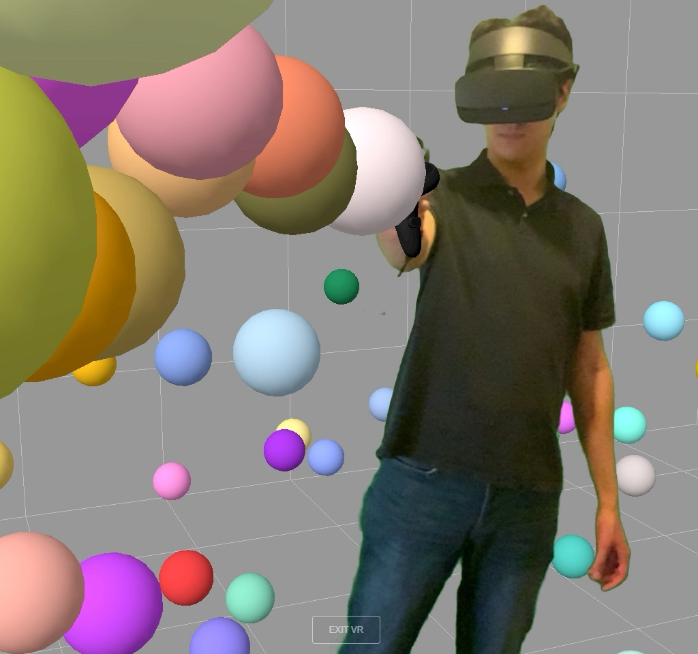
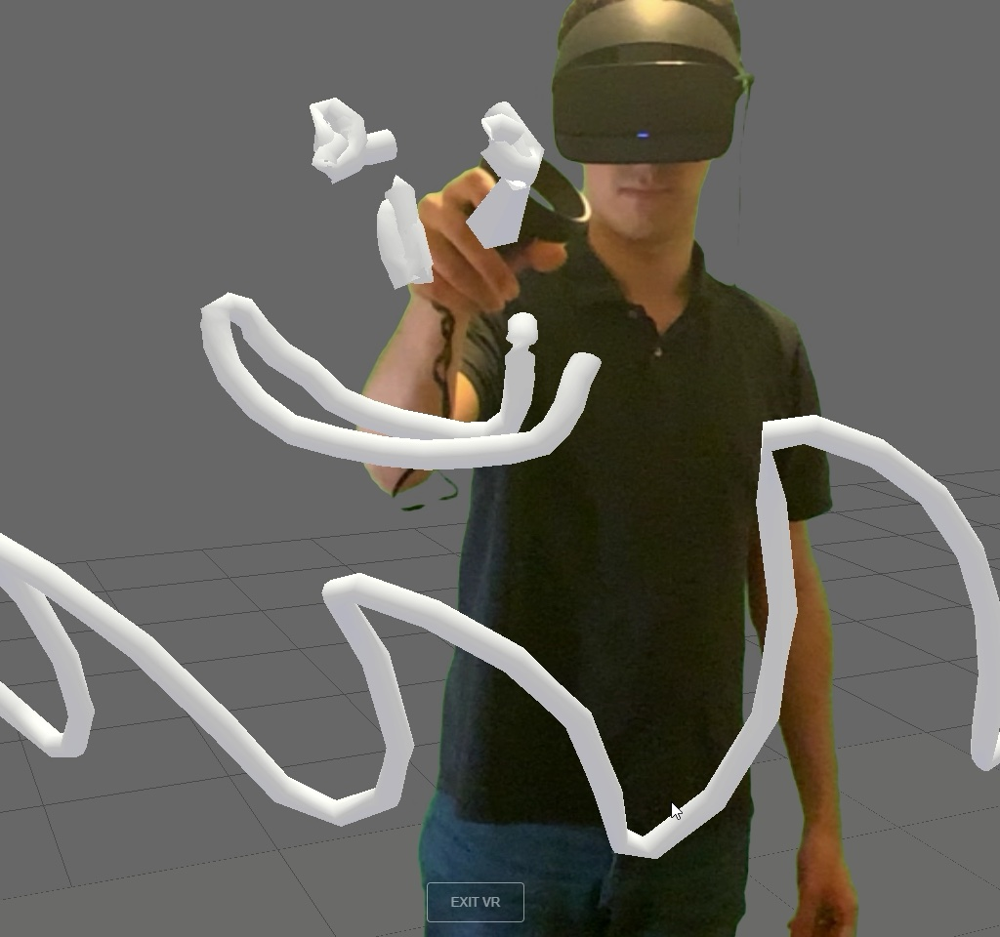

# Reality Mixer JS

This is a small Mixed Reality Capture module for [WebXR](https://immersiveweb.dev) + [Three.js](https://threejs.org).

You can use this module to allow users to record your WebXR experiences in Mixed Reality. 

Unlike the original [Reality Mixer](https://github.com/fabio914/RealityMixer) or [LIV](https://www.liv.tv), the Mixed Reality composition is happening on the browser itself. However, users will need another external application to record their browser (e.g. [OBS](https://obsproject.com)).

Keep in mind that this is still just a prototype and that I'm not a frontend developer. Feel free to open PRs and contribute to the project.

[YouTube video](https://youtu.be/t0TmLT84J_0)

## Screenshots

| Example | Screenshot |
|---------|---------------|
| webxr_vr_ballshooter |  |
| webxr_vr_paint |  |

## TO-DOs

 - Continue iterating on the Calibration.
 
 - Create a static website to host the examples.

## How to test the example

 - Clone this repository.
 
 - Run `npm ci` to download the dependencies.
 
 - Run `http-server` to start the HTTP server (that can be downloaded by running `npm install -g http-server`).

 - WebXR and `navigator.mediaDevices` require HTTPS. You could use a tool like [localtunnel](https://github.com/localtunnel/localtunnel) for testing. You can run `npm install -g localtunnel` to download it and then you can run `lt --port 8080 --subdomin 127.0.0.1` in a separate terminal.
 
 - Open your browser and navigate to `https://{your HTTPS domain}/examples/webxr_vr_ballshooter.html`

 Your browser will ask for permission to access your camera, and it'll ask for permission to use your VR headset once you click on the WebXR button. 
 
 You'll need to edit the code (the calibration) to set the correct position, orientation, and fov of your camera, and the correct parameters for your green screen.
 
 ## API
 
 ```javascript
 
import * as THREE from 'three';
import * as MRC from 'reality-mixer';
 
let mixedRealityCapture;
let scene, renderer, camera;

// ...
 
const cameraCalibration = new MRC.CameraCalibration(
    1920, // width of the video
    1080, // height of the video
    38, // vertical field of view in degrees
    [0, 1.5, 0], // vector with the position of the camera in scene coordinates
    [0, 0, 0, 1] // quaternion with the orientation of the camera
);

const chromaKey = new MRC.ChromaKey(
    [0, 1, 0], // chroma key color (red, green, blue values from 0 to 1)
    0.25, // similarity (0 to 1)
    0 // smoothness (0 to 1)
);
 
const calibration = new MRC.Calibration(
    cameraCalibration,
    chromaKey,
    4, // Delay (in number of frames) between the real camera and the virtual camera
);

// ... Initialize your Three.js scene and renderer here ...

// Hide your renderer when you want to display the Mixed Reality output
renderer.domElement.style.display = "none";

// Create a new Mixed Reality Capture session
mixedRealityCapture = new MRC.MixedRealityCapture( calibration );

// Add the Mixed Reality Output to the document
document.body.appendChild( mixedRealityCapture.domElement );

// ...

// You should call this whenever the window resizes
mixedRealityCapture.onWindowResize();

// ...

// Render the Mixed Reality composition after rendering your scene

renderer.render( scene, camera );

mixedRealityCapture.render( renderer.xr, scene );

```

Alternatively, you can instantiate the calibration with a JSON provided by the user:

```javascript

// ...

const json = `
{ 
    "schemaVersion": 1, 
    "camera": { 
        "width": 1280, 
        "height": 720, 
        "fov": 38, 
        "position": [0, 1.5, 0], 
        "orientation": [0, 0, 0, 1] 
    }, 
    "chromaKey": {
        "color": [0, 1, 0],
        "similarity": 0.25,
        "smoothness": 0
    },
    "delay": 4
}
`;

const calibrationData = JSON.parse( json );

const calibration = MRC.Calibration.fromData( calibrationData );

// ...

mixedRealityCapture = new MRC.MixedRealityCapture( calibration );

// ...

```
